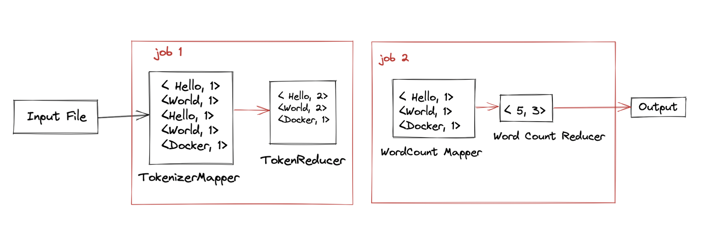

# Welcome to MBD Assignment Documentation

This Documentation consists of the answers to the assignment questions and the code used to solve the assignment.
You can find the readme file in the particular exercise folders for more information.

!!! note "Private Repository till grades are released"
    <i>Due to academic integrity policies, The source code will be submitted in the group's tab. And all the information about the code & application can be found in the documentation and report submitted.</i>

## Exercise 3

---

Run the given program in both standalone and pseudo-distributed mode and record the outputs.
<p>The program should be able to run in both modes and the outputs should be the same.</p>

You can find the code in the `exercise3` folder under both `MacOS` & `Cloudera` folders.
<p>The instructions to run the program is given [here](#how-to-run-the-program)</p>

---

## Exercise 4 

--- 

### Part 1

Program to count the number of words with the specific number of letters uses a Mapper to convert the input to key-value pairs of `<length, 1>` and Reducer will reduce the key-value pairs to `<SameLength, n>`. The input string is sanitized against delimiter to get the proper words. Dataflow is as follows: 


### Part 2

Program to count the number of words (unique) with the specific number of letters, we have decided to submit two solutions as both have their significant impact on the computation. 

#### a. ChainMapper 
Using  `ChainMapper`, the program will first convert the input to key-value pairs of `<word, 1>` and then the second mapper will get the unique words and convert them to `<word, 1>`. The third mapper will get the length of the word and replace the key-value pairs as `<WordLength, 1>`. The Reducer will reduce the key-value pairs to `<WordLength, n>`. The computation is slower compared to the other solution. For the firstInputFile, it takes around ~8 ms to complete the computation. But the resource consumption is lower. (datanode, resourcemanager, yarn, nodemanager.) Dataflow is as follows: 


#### b. Two MapReduce Jobs
Considering working with Two MapReduce Jobs instead of a single job, the program will first convert the input to key-value pairs of `<word, 1>` and reducer will get the count of the words. The second job will map the unique words and convert them to `<word, 1>` and reduce the key-value pairs to `<WordLength, n>`. Compared to the other solution, it is faster. For the firstInputFile, it takes around ~2 ms to complete the computation. But the resource consumption is higher. (datanode, resourcemanager, yarn, nodemanager.) Dataflow is as follows: 


## How to run the program.

For MacOS, you can find the installation guide [here](#macos-instructions)

For Windows, you can find the installation guide [here](#cloudera-setup-instructions)

## Folder Structure

The repository consists of two different OS folders as both of team members used different setup for running the assignment problems, For Mac OS with M1 Chip we have used Docker and VM Cloudera was done by the Assignment Handout instructions. Exercise 3 & 4 and the report latex file will found on the root.

```js
mbd-assignment
├── README.md
├── package.json
├── .gitignore
├── docs
│   ├── docs
│   └── mkdocs.yml
├── MacOS
│   ├── Exercise4
│   │   ├── src
│   │   │   ├── com.mbdassign.wordfreq
│   │   │   │   ├── CustomUniqueWordCount.java # Custom Unique Word Count Using Chain Mapper
│   │   │   │   ├── CustomWordCount.java
│   │   │   │   ├── UniqueWordsTwoJobs.java # Custom Unique Words Using Two MapReduceJobs
│   │   ├── input # input folders
│   │   ├── output # output folders (Artifacts)
│   ├── Exercise3
│   │   ├── src
│   │   │   ├── com.basicsetup.hadoop
│   │   │   │   ├── WordCount.java
│   │   ├── input # input folders
│   │   ├── output # output folders (Artifacts)
├── VM Cloudera
│   ├── Exercise 4
│   │   ├── src
│   │   │   ├── com.mbdassign.wordfreq
│   │   │   │   ├── CustomUniqueWordCount.java # Custom Unique Word Count Using Chain Mapper
│   │   │   │   ├── CustomWordCount.java
│   │   │   │   ├── UniqueWordsTwoJobs.java # Custom Unique Words Using Two MapReduceJobs
└── src

```

## Cloudera Instructions

For the Cloudera Setup, we use VirtualBox. For the setting up the environment we have followed the steps given in the [handout.](http://snap.stanford.edu/class/cs246-2017/homeworks/hw0/tutorialv3.pdf)

### Running the program
The given source code is compiled and the jar file can be used to run the program.

```bash 
hdfs dfs -mkdir /input
hdfs dfs -put input/* /input
hdfs dfs -ls /input
hdfs dfs -cat /input/input.txt
hadoop jar WordCount.jar com.basicsetup.hadoop.WordCount /input/input.txt /output
hdfs dfs -ls /output
hdfs dfs -cat /output/part-r-00000
hdfs dfs -get /output
```


## MacOS Instructions

### Requirements

The best way to install Docker on MacOS is Homebrew Cask.

```bash
brew cask install docker # Install Docker
open /Applications/Docker.app # Start Docker
```

### Using docker-hadoop

To run Hadoop on Arm64 (Apple M1 Chip) and Intel Native we have used [docker-hadoop](https://github.com/wxw-matt/docker-hadoop)

##### Spinning up the environment for Standalone mode

Open terminal and clone the docker-hadoop. Then run the following commands

```bash
git clone https://github.com/wxw-matt/docker-hadoop # Clone the docker-hadoop
cd hadoop-standalone  # Go to the docker-hadoop folder
docker build -t wxwmatt/hadoop-standalone:2.1.1-hadoop3.3.1-java8 .  # Build the image
```

##### Running the Hadoop Standalone mode

Once the image is built, you can get in the container by running the following command

```bash
docker container run --name standalone -it {$imageID} /bin/bash # Run the container
```

!!! note "To get the imageID"
    <i>You can use the command `docker images` to get the imageID.</i>

The commands given below will run the Hadoop Standalone mode.

```bash
mkdir -p /hadoop/input/ # Create the input folder
cp input/* /hadoop/input/ # Copy the input files to the input folder
hadoop jar {$jarFileName}.jar {$className} /hadoop/input/ /hadoop/output/ # Run the jar file
cat /hadoop/output/part-r-00000 # Print the output
```

##### Spinning up the environment for Pseudo-distributed mode

Open terminal and clone the docker-hadoop. Then run the following commands

```bash
git clone https://github.com/wxw-matt/docker-hadoop # Clone the docker-hadoop
cd docker-hadoop # Go to the docker-hadoop folder
docker-compose up # Spin up the environment and wait for the environment to spin up.
```

##### Running the Hadoop Job (Pseduo Distributed Mode)

Once the environment is up and running, we can run the Hadoop Job. We can do the following inside the `namenode` container of the environment. The `namenode` container will be mounting the `/app` folder of the environment from the host machine. The `/app` folder will contain the jars and the input files for the program.

```bash
docker exec -it namenode /bin/bash
hdfs dfs -mkdir /input
hdfs dfs -put /app/input/* /input
hdfs dfs -ls /input
hdfs dfs -cat /input/input.txt
hadoop jar /app/WordCount.jar com.basicsetup.hadoop.WordCount /input/input.txt /output
hdfs dfs -ls /output
hdfs dfs -cat /output/part-r-00000
hdfs dfs -get /output
exit
```

The output of the program will be stored in the `/output` folder in the container, to get the output from the container, we can use the following command.

```bash
docker cp namenode:/app/output .
```

Your local machine will have the /output folder with the output of the program.

Special Thanks for [Matt](https://github.com/wxw-matt) ❤️ for the work on [Docker Hadoop](https://github.com/wxw-matt/docker-hadoop).
